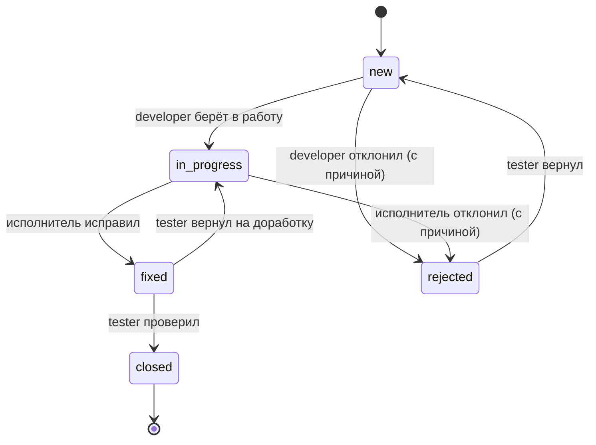

# Баг-трекер


<!-- Бейдж Qlty — после подключения Qlty (этап 13) -->

Веб-приложение для учёта багов в проектах: тестировщики заводят баги,
разработчики берут их в работу и исправляют, тестировщики проверяют и закрывают.
У каждого бага — история смены статусов и обсуждение в комментариях.

Учебный проект для производственных практик ПМ02 «Осуществление интеграции
программных модулей» и ПМ11 «Разработка, администрирование и защита баз данных».
Основа — [Flask Mega-Tutorial](https://blog.miguelgrinberg.com/post/the-flask-mega-tutorial-part-i-hello-world)
(репозиторий создан с нуля, предметная область — баг-трекер вместо микроблога).

**Рабочая версия:** https://bugtracker-9p9c.onrender.com/ — вход демо-аккаунтами
(раздел «Демо-данные»). Бесплатный сервер засыпает без посетителей: первое
открытие может занять до минуты.

## Возможности

- Регистрация с одобрением администратором; вход, выход, блокировка пользователей.
- Проекты и участники; баги видят только участники проекта и администратор.
- Баги: создание, карточка, редактирование, назначение исполнителя.
- Смена статусов по правилам жизненного цикла и ролей; отклонение — только с причиной.
- История статусов (пишет триггер PostgreSQL) и комментарии.
- Фильтры списка багов и страница статистики (представления PostgreSQL).
- Администрирование пользователей: одобрение заявок, роли, блокировка, создание.
- Страницы ошибок 400/403/404/500, журнал в файл.
- Демо-данные одной командой.

### Роли

| Роль | Что может |
|---|---|
| **admin** | управляет пользователями и проектами, видит всё; статусы багов не меняет |
| **tester** | заводит баги в своих проектах, проверяет исправления: закрывает или возвращает в работу |
| **developer** | берёт баги в работу, помечает исправленными, отклоняет с причиной |

Комментировать может любой, кто видит баг. Редактировать баг — автор и admin.

### Жизненный цикл бага



Недопустимые переходы отклоняются с понятным сообщением. Все правила — в
`app/workflow.py`.

## Стек

- **Python 3.14**, **Flask 3.1** — приложение разбито на модули (blueprints):
  `auth`, `projects`, `bugs`, `admin`.
- **PostgreSQL 18** — драйвер psycopg 3; **SQLAlchemy 2** через Flask-SQLAlchemy;
  миграции — **Flask-Migrate** (Alembic).
- **Flask-Login** — вход и сессии; **Flask-WTF** — формы и защита от CSRF.
- Шаблоны **Jinja2** и простой CSS без фронтенд-фреймворков.
- Тесты — **pytest** и **Playwright** (сквозные тесты в браузере); линтер — **ruff**.

## Установка и запуск (Windows, PowerShell)

Нужны: **Python 3.14** (проект проверен на этой версии), **Git**, **PostgreSQL 18**
(с утилитой `psql` в PATH).

**1. Код и виртуальное окружение**

```powershell
git clone <адрес репозитория> bugtracker
cd bugtracker
python -m venv venv
.\venv\Scripts\Activate.ps1
pip install -r requirements-dev.txt
```

`requirements-dev.txt` — приложение плюс инструменты разработки (pytest,
Playwright, ruff). На сервер ставится только `requirements.txt`: приложение и
веб-сервер gunicorn.

Если PowerShell запрещает запуск `Activate.ps1`:
`Set-ExecutionPolicy -Scope CurrentUser RemoteSigned`.

**2. База данных и её владелец** (от имени администратора PostgreSQL)

```powershell
psql -U postgres
```

```sql
CREATE USER bugtracker WITH PASSWORD 'придумайте_пароль';
CREATE DATABASE bugtracker OWNER bugtracker ENCODING 'UTF8' TEMPLATE template0;
\q
```

**3. Настройки** — скопируйте образец и впишите свои значения:

```powershell
Copy-Item .env.example .env
python -c "import secrets; print(secrets.token_hex(32))"   # значение для SECRET_KEY
```

В `.env` обязательны `SECRET_KEY` и `DATABASE_URL`. Файл `.env` в Git не попадает.

**4. Таблицы, триггер, представления, справочник ролей** — миграциями:

```powershell
flask db upgrade
```

**5. Первый администратор** (пароль спрашивается скрыто):

```powershell
flask create-admin
```

Или сразу демо-данные с готовыми аккаунтами — `flask seed` (раздел ниже).

**6. Запуск**

```powershell
flask run
```

Приложение откроется на http://127.0.0.1:5000/. Режим отладки включён в `.flaskenv`.

## Демо-данные

Команда `flask seed` создаёт демонстрационные аккаунты, проект и баги:

| Логин | Роль | Пароль |
|---|---|---|
| `pixel` | admin | `qwerty123` |
| `ana` | tester | `qwerty` |
| `bob` | developer | `qwerty` |

Проект «Демо: интернет-магазин» (участники ana и bob) и 5 багов — по одному в
каждом статусе (новый, в работе, исправлен, закрыт, отклонён), с комментариями и
историей статусов.

> ⚠️ **Пароли демо-аккаунтов известны всем**, у `pixel` — права
> администратора. Любой, кто откроет сайт, может войти как `pixel`: видеть почты
> зарегистрированных пользователей, создавать админов, блокировать. **На сайте с
> демо-данными не должно быть настоящих данных.**

### Локально

Из папки проекта, виртуальное окружение активно, миграции применены
(`flask db upgrade`):

```powershell
flask seed                  # создать демо-данные
flask seed --restore-demo   # вернуть демо-аккаунты в рабочее состояние
```

- **`flask seed`** можно запускать сколько угодно раз: уже созданное не
  дублируется, команда пишет «уже есть».
- **`flask seed --restore-demo`** — если посетители «сломали» демо: заблокировали
  аккаунт, сменили роль или пароль, убрали из проекта. Команда разблокирует
  `pixel`, `ana` и `bob`, вернёт им роли и пароли, вернёт ana и bob в
  демо-проект. **Баги, комментарии, другие пользователи и проекты не меняются.**
  Если демо-проект переименовали, команда восстановит только аккаунты и сообщит,
  что проект не найден.

Демо-аккаунтом считается пользователь, у которого совпадают **и логин, и почта**
`<логин>@demo.example`. Если кто-то зарегистрируется, например, как `bob` со
своей почтой, `flask seed` откажется работать, а `--restore-demo` этого
пользователя пропустит — его пароль и роль не тронут.

### На деплое

- **`flask seed` — в команде запуска** на Render, перед gunicorn. Повторный
  запуск ничего не дублирует, а в новой базе (после миграций) демо-данные
  появятся сами.
- **`flask seed --restore-demo`** — вручную со своего компьютера, когда демо
  «сломали». Как подключиться к базе на Render — в разделе
  [«Деплой»](#команды-для-базы-на-render-со-своего-компьютера).

Обеим командам хватает прав роли приложения `bugtracker_app` (проверено);
владелец базы нужен только для миграций.

## База данных

Схема — 7 таблиц: `roles`, `users`, `projects`, `project_members`, `bugs`,
`comments`, `status_history`. Структура создаётся миграциями
(`migrations/versions/`), справочная SQL-версия схемы — `schema.sql`.

Объекты БД сверх таблиц:

- **CHECK-ограничения** — допустимые статусы, серьёзность, приоритет;
  «активный пользователь обязательно одобрен».
- **Индексы** — `bugs(project_id)`, `bugs(status)`, `bugs(assignee_id)`.
- **Триггер** `trg_bugs_status_history` — при каждой смене статуса бага сам
  пишет строку в `status_history`.
- **Представления** `v_bug_stats` и `v_open_bugs_by_assignee` — для страницы
  статистики.
- **Роли с минимальными правами** — `bugtracker_app` для приложения (журналы
  `comments` и `status_history` — только чтение и добавление; без DROP/ALTER) и
  `bugtracker_readonly` для отчётов (без `password_hash`).

Файлы в `sql/`:

| Файл | Что это | Кто запускает |
|---|---|---|
| `sql/roles.sql` | создать роли и пароли, затем выдать права | администратор PostgreSQL |
| `sql/grants.sql` | выдать права ролям (после миграций с новыми таблицами) | владелец базы |
| `sql/check_roles.sql` | проверить права ролей (изменения откатываются) | под каждой ролью |
| `sql/queries.sql` | показательные SQL-запросы (изменения откатываются) | владелец базы |

```powershell
psql -U postgres -d bugtracker -f sql/roles.sql
psql -U bugtracker -d bugtracker -f sql/queries.sql
```

## Тесты

Тесты работают с **отдельной базой** — её имя должно заканчиваться на `_test`
(тесты стирают в ней данные). Строка подключения — `TEST_DATABASE_URL` в `.env`
(образец в `.env.example`). Базу создаёт администратор PostgreSQL:

```powershell
psql -U postgres -c "CREATE DATABASE bugtracker_test OWNER bugtracker ENCODING 'UTF8' TEMPLATE template0;"
```

Запуск (из папки проекта, виртуальное окружение активно):

```powershell
pytest                     # все тесты
pytest -m "not e2e"        # быстро, без браузера
pytest -m e2e              # только сквозные тесты в браузере
pytest -m e2e --headed --slowmo 500   # показать окно браузера и замедлить действия
```

### Сквозные тесты в браузере (Playwright)

e2e-тесты запускаются в **установленном браузере — Microsoft Edge или Google
Chrome**. Отдельно скачивать браузеры Playwright (`playwright install`) **не
нужно**.

По умолчанию используется Edge — он есть в Windows. Настройка — `addopts` в
`pytest.ini`: `--browser-channel msedge`. Чтобы запустить в Chrome, укажите
канал в командной строке (он главнее значения из `pytest.ini`):

```powershell
pytest -m e2e --browser-channel chrome
```

Если выбранного браузера нет на компьютере, Playwright сообщит
`Chromium distribution 'chrome' is not found` — установите браузер или
используйте другой канал.

### Что проверяют тесты

| Файл | Что проверяет |
|---|---|
| `tests/test_workflow.py` | правила жизненного цикла бага (без базы) |
| `tests/test_access.py` | права доступа; все маршруты: вход обязателен, действия только POST, CSRF |
| `tests/test_auth.py` | вход, выход, регистрация, `flask create-admin` |
| `tests/test_scenarios.py` | 24 сквозных сценария под ролью БД `bugtracker_app` (`docs/test_scenarios.md`) |
| `tests/test_db_roles.py` | права ролей PostgreSQL (`sql/grants.sql`) |
| `tests/test_errors.py` | страницы ошибок 400/403/404/500 |
| `tests/test_logging.py` | записи журнала; пароли в журнал не попадают |
| `tests/test_seed.py` | `flask seed` и `--restore-demo` |
| `tests/test_e2e.py` | вход, создание бага, смена статуса в браузере |
| `tests/test_infrastructure.py` | сама тестовая инфраструктура |

Тесты ролей и сценарии под `bugtracker_app` пропускаются, если в `.env` нет
`APP_DATABASE_URL` / `READONLY_DATABASE_URL` (роли создаёт `sql/roles.sql`).

## Проверка кода

```powershell
ruff check .      # линтер: стиль PEP 8, ошибки, порядок импортов, вероятные баги
pytest            # все тесты
```

## Журнал

Приложение пишет журнал в `logs/bugtracker.log` (ротация: 1 МБ, 10 файлов):
входы и неудачные попытки, отказы в доступе, действия администратора, ошибки
сервера с трассировкой. Пароли в журнал не попадают. Папка `logs/` не
хранится в Git.

```powershell
Get-Content logs\bugtracker.log -Tail 20 -Encoding utf8
```

## Безопасность

- Пароли хранятся только в виде хэша (scrypt с солью).
- Все изменяющие действия — POST-запросы с CSRF-токеном; GET ничего не меняет.
- Доступ к проектам и багам проверяется на сервере; к чужому — ответ 403.
- Защита от open redirect после входа; вывод в шаблонах экранируется (XSS).
- Секреты — только в `.env` (на Render — в переменных окружения сервиса).
- На деплое: только HTTPS, cookie входа с флагами `Secure` и `HttpOnly`,
  сайт работает под ролью БД `bugtracker_app` с минимальными правами.

## Резервное копирование

Копия — `pg_dump`, восстановление — `pg_restore`; инструкция с проверкой
восстановления — [docs/backup.md](docs/backup.md).

```powershell
pg_dump -U bugtracker -d bugtracker -F c -f "backups\bugtracker.dump"
```

## Структура проекта

```
bugtracker/
├── app/                    приложение
│   ├── __init__.py         фабрика create_app(), подключение модулей
│   ├── models.py           модели SQLAlchemy
│   ├── workflow.py         правила жизненного цикла бага
│   ├── assignments.py      правила назначения исполнителей
│   ├── access.py           проверки доступа к проектам и багам
│   ├── stats.py            чтение представлений статистики
│   ├── demo.py             демо-данные (flask seed)
│   ├── cli.py              команды flask create-admin, flask seed
│   ├── errors.py           страницы ошибок
│   ├── logs.py             журнал в файл
│   ├── auth/ projects/ bugs/ admin/   модули (blueprints): маршруты и формы
│   ├── templates/          шаблоны Jinja2
│   └── static/style.css    стили
├── migrations/             миграции Alembic (таблицы, триггер, представления)
├── sql/                    роли, права, проверки, показательные запросы
├── tests/                  тесты pytest и Playwright
├── docs/                   документация
├── config.py               настройки (читаются из .env)
├── bugtracker.py           точка входа
├── schema.sql              справочная SQL-версия схемы
├── pyproject.toml          настройки ruff
└── pytest.ini              настройки pytest
```

## Документация

- [docs/test_scenarios.md](docs/test_scenarios.md) — 24 сквозных сценария.
- [docs/backup.md](docs/backup.md) — резервное копирование и восстановление.
- [docs/notes.md](docs/notes.md) — заметки по этапам разработки.

## Деплой

Рабочая версия: https://bugtracker-9p9c.onrender.com/ — хостинг
[Render](https://render.com), бесплатный тариф: веб-сервис и PostgreSQL 18 в
регионе Frankfurt. Сайт обновляется сам после каждого `git push` в ветку `main`.

Ограничения бесплатного тарифа:

- веб-сервис засыпает через 15 минут без посетителей, первое открытие после
  этого — до минуты;
- **бесплатная база работает 30 дней**, потом ещё 14 дней недоступна и
  удаляется. Дата — на странице базы в панели Render. Как продлить — ниже,
  «Перенос базы»;
- бесплатная база — одна на аккаунт; задания по расписанию (cron) платные,
  поэтому `restore-demo` запускается вручную.

### Как устроено

| Настройка веб-сервиса | Значение |
|---|---|
| Build Command | `pip install -r requirements.txt` |
| Start Command | `flask seed && gunicorn --bind 0.0.0.0:$PORT bugtracker:app` |
| Версия Python | из файла `.python-version` |

Переменные окружения (Render → сервис → **Environment**; в репозитории их нет):

| Переменная | Значение |
|---|---|
| `DATABASE_URL` | адрес роли `bugtracker_app` по **внутреннему** хосту базы, с `?sslmode=require&channel_binding=disable` |
| `SECRET_KEY` | случайный, кнопка **Generate** (не тот, что локально) |
| `LOG_TO_STDOUT` | `1` — журнал на вкладке **Logs** |
| `SECURE_COOKIES` | `1` — cookie входа только по HTTPS |
| `FLASK_DEBUG` | `0` — перекрывает `FLASK_DEBUG=1` из `.flaskenv` |

**Сайт работает под ролью `bugtracker_app`**, а не под владельцем базы: у неё
нет прав менять структуру таблиц и удалять журналы. Поэтому миграции не
запускаются при старте сайта — их выполняет владелец со своего компьютера
(ниже). Адрес владельца на Render не хранится.

### Команды для базы на Render со своего компьютера

Нужен адрес базы: панель Render → база → **Connections** → **External Database
URL** (это адрес владельца). Адрес вводится через `Read-Host` — так он не
попадает в историю команд PowerShell. Переменная `DATABASE_URL` из окна
PowerShell главнее значения в `.env`.

```powershell
.\venv\Scripts\Activate.ps1
$env:DATABASE_URL = Read-Host "Адрес базы Render"   # вставить адрес, Enter

flask db upgrade                            # миграции (нужен владелец)
psql $env:DATABASE_URL -f sql/grants.sql    # права ролям, если миграция добавила таблицы
flask seed --restore-demo                   # вернуть демо-аккаунты

Remove-Item Env:DATABASE_URL                # дальше снова работаем с локальной базой
```

`--restore-demo` можно запускать и под `bugtracker_app` — тогда вместо адреса
владельца введите адрес этой роли по **внешнему** хосту с
`?sslmode=require&channel_binding=disable` (без `channel_binding=disable`
Render не пропускает такое подключение снаружи).

> ⚠️ Не забудьте `Remove-Item Env:DATABASE_URL` (или закройте окно): иначе
> следующие команды `flask` в этом окне пойдут в базу на Render.

**Новая версия с миграцией:** сначала `flask db upgrade` (и `grants.sql`, если
появились таблицы) для базы Render, потом `git push` — иначе новый код
запустится на старой структуре базы.

### Перенос базы (продление после 30 дней)

Бесплатная база одна, поэтому старую нужно удалить **до** создания новой.
Всё, что в ней было, пропадёт, — если данные нужны, сначала сделайте копию и
проверьте её (подробнее о копиях — [docs/backup.md](docs/backup.md)):

```powershell
$env:DATABASE_URL = Read-Host "Адрес СТАРОЙ базы Render"
$date = Get-Date -Format "yyyy-MM-dd"
pg_dump -d $env:DATABASE_URL -F c -f "backups\render_$date.dump"
pg_restore --list "backups\render_$date.dump"   # есть TABLE DATA, VIEW, TRIGGER
```

Затем:

1. Панель Render → старая база → **Settings** → **Delete Database**.
2. **New → Postgres**: регион **Frankfurt**, PostgreSQL 18, тариф Free.
3. Структура и данные в новой базе (адрес — External Database URL новой базы):

   ```powershell
   $env:DATABASE_URL = Read-Host "Адрес НОВОЙ базы Render"
   # Вариант 1 — с данными из копии:
   pg_restore -d $env:DATABASE_URL --no-owner --no-privileges "backups\render_$date.dump"
   # Вариант 2 — пустая база (демо-данные создаст сам сайт при запуске):
   flask db upgrade
   # В обоих вариантах — роли сайта и отчётов (спросит их новые пароли):
   psql $env:DATABASE_URL -f sql/roles.sql
   Remove-Item Env:DATABASE_URL
   ```

4. Веб-сервис → **Environment** → `DATABASE_URL`: новый адрес роли
   `bugtracker_app` — внутренний хост и имя базы из **Internal Database URL**
   новой базы, пароль — заданный в `roles.sql`:
   `postgresql://bugtracker_app:ПАРОЛЬ@ХОСТ/БАЗА?sslmode=require&channel_binding=disable`.
   **Save, rebuild and deploy**.
5. Проверить сайт: вход `pixel`, `ana`, `bob`.
